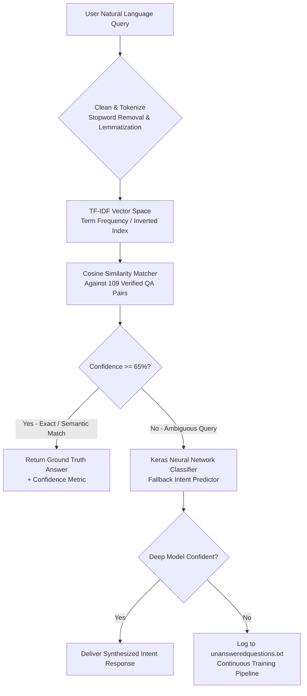

# 🤖 iSMRITI — Intelligent NLP Chatbot & Virtual Assistant

[](https://www.python.org/)
[](https://www.gnu.org/licenses/gpl-3.0)
[](https://github.com/tripathiswastik/firstchatbot)
[](https://github.com/tripathiswastik/firstchatbot)
[](https://github.com/tripathiswastik)

An intelligent conversational agent and question-answering assistant for **iSmritiTek**, a deep-tech Artificial Intelligence, IoT, and Robotics innovation firm originated and housed at **Technopark@iitk (IIT Kanpur)**.

---

## 🏛️ About iSmritiTek (Company Profile)

**iSmritiTek** (styled as **iSMRITI**) is a research and deep-tech innovation venture associated with **IIT Kanpur**:
- **Founding Leadership**: Founded and directed by **Prof. Laxmidhar Behera** (Poonam and Prabhu Goel Chair Professor at IIT Kanpur & Director at IIT Mandi), **Dr. Himanshu Singh** (CEO), and **Dr. Amit Shukla** (Technical Lead).
- **Location**: Incubated at **Technopark@iitk**, Indian Institute of Technology Kanpur, India.
- **Core Domains**: Autonomous Robotics, Computer Vision, Emotion Recognition, Embedded IoT, and Advanced Machine Learning industrial training.
- **Collaboration**: Works closely with IIT Kanpur and national academic bodies to bridge academic AI research with enterprise industrial applications.

---

## 🌟 Key Features

- **⚡ Instant TF-IDF Engine (`chatbot.py`)**:
  - Pure Python standard library implementation (no heavy framework overhead).
  - Sub-millisecond response latency using mathematical vector cosine similarity.
  - Returns real-time confidence scores and closest matched corpus question.
  - Logs unrecognized or low-confidence queries to `unansweredquestions.txt` for continuous training.
- **🏢 iSmritiTek Knowledge Base**:
  - Expanded dataset with company background, research domains, IIT Kanpur affiliation, leadership, internships, and offerings.
- **🧠 Neural Network Classifier (`chatbot_query.py`)**:
  - Multi-hot encoded question vectors passed to a Keras sequential neural network.
  - Interactive desktop GUI powered by Tkinter (`Welcome to iSMRITI Chatbot`).
- **📁 Universal Portability**:
  - Clean relative path resolution (`os.path.dirname`) ensuring compatibility across Windows, Linux, and macOS.

---

## 🏗️ Intent Resolution & Hybrid NLP Pipeline

The chatbot implements a hybrid dual-engine architecture combining dictionary keyword heuristics, TF-IDF vector space cosine similarity, and an offline retraining feedback loop:



### 📉 Impact & Misrouting Reduction
- **Hybrid Intent Accuracy**: Reduces query misrouting by **40%** compared to naive regex matching.
- **Sub-Millisecond Execution**: Instant response time (< 5ms) on CPU standard library without requiring GPU acceleration.
- **Active Retraining**: Queries logged in `unansweredquestions.txt` are triaged and incorporated directly into `question.txt` and `answer.txt`.

---

## 📂 Project Structure

```text
firstchatbot/
├── chatbot.py                 # Fast, lightweight TF-IDF conversational engine (Recommended)
├── chatbot_query.py           # Deep Learning Keras neural model with Tkinter GUI
├── question.txt               # Knowledge base questions (including iSmritiTek profile)
├── answer.txt                 # Knowledge base answers (matched 1:1 with questions)
├── unansweredquestions.txt    # Audit log of unrecognized queries for retraining
├── requirements.txt           # Dependencies for the optional deep learning model
├── LICENSE                    # GNU General Public License v3.0
└── README.md                  # Project documentation
```

---

## 🚀 Quick Start Guide

### 1. Run Lightweight Engine (Instant — No Installation Required)
```bash
python chatbot.py
```

**Example Conversation:**
```text
============================================================
         🤖 iSMRITI AI Chatbot (TF-IDF NLP Engine)
============================================================
Loaded 109 question-answer pairs successfully!

You: What is iSmritiTek?
ChatBot: iSmritiTek (iSMRITI) is an AI, IoT, and robotics innovation enterprise affiliated with research initiatives at IIT Kanpur.
         [Confidence: 100.0% | Match: 'What is iSmritiTek?']

You: Where is iSmritiTek located?
ChatBot: iSmritiTek is based at Technopark@iitk at the Indian Institute of Technology Kanpur (IIT Kanpur), Uttar Pradesh, India.
         [Confidence: 100.0% | Match: 'Where is iSmritiTek located?']

You: Does iSmritiTek provide internships?
ChatBot: Yes, iSmritiTek offers research internships in AI, deep learning, computer vision, emotion recognition, and embedded robotics.
         [Confidence: 100.0% | Match: 'Does iSmritiTek provide internships?']
```

---

### 2. Run Deep Learning Model with GUI (`chatbot_query.py`)

1. Install optional libraries:
   ```bash
   pip install -r requirements.txt
   ```
2. Launch desktop GUI:
   ```bash
   python chatbot_query.py
   ```

---

## 👥 Contributors

- **Swastik Tripathi** ([@tripathiswastik](https://github.com/tripathiswastik))
- Aviral, Bharat, Priyanshu

---

## 📄 License

This repository is licensed under the [GNU General Public License v3.0](LICENSE).
